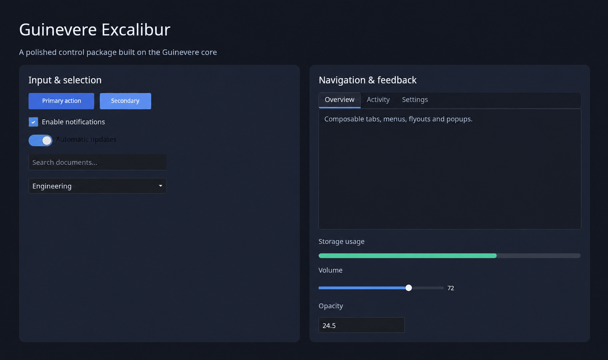

# Guinevere.Excalibur

A ready-to-use set of default controls for the [Guinevere](https://github.com/MASS4ORG/Guinevere)
immediate-mode GUI library. Everything here is an extension method on `Gui` living in the `Guinevere`
namespace, so it drops into an existing Guinevere app with a single package reference and no setup.



## Install

```
dotnet add package MASS4.Guinevere.Excalibur
```

## Quick Start

```csharp
using Guinevere;

public partial class App
{
    private bool _isEnabled = true;
    private string _name = "";
    private float _volume = 0.5f;
    private int _activeTab;

    public void Draw(Gui gui)
    {
        if (gui.Button("Run")) { /* clicked */ }
        gui.Checkbox(ref _isEnabled, "Enable feature");
        gui.TextInput(ref _name, "Your name");
        gui.Slider(ref _volume, 0f, 1f);

        gui.Tabs(ref _activeTab, tabs =>
        {
            tabs.Tab("Home", () => gui.DrawText("Home content", 12, Color.Gray));
            tabs.Tab("Settings", () => gui.DrawText("Settings content", 12, Color.Gray));
        });
    }
}
```

## Controls

| Group | APIs | Purpose |
|-------|------|---------|
| Actions | `Button`, `IconButton`, `ImageButton` | Pointer and keyboard-activated buttons with focus feedback. |
| Selection | `Checkbox`, `Toggle`, `RadioButton`, `RadioGroup`, `Dropdown` | Boolean, exclusive, and list selection. |
| Text and values | `TextInput`, `PasswordInput`, `TextArea`, `NumberField`, `Slider`, `ObjectField` | Text editing, scrub editing, numeric ranges, and compact object fields. |
| Display | `Image`, `ProgressBar`, `WrappedText`, `Toast`, `Toasts`, `ClearToasts` | Images, progress, wrapping, and transient notifications. |
| Navigation | `Tabs`, `TabBar`, `TabStrip`, `PillTabs`, `VerticalTabs`, `Breadcrumb`, `TreeView`, `FileBrowser` | Tabs, trails, virtualised trees, and an embeddable filesystem picker. Tabs are closable only with `closable: true`. |
| Menus and overlays | `MenuBar`, `Flyout`, `CascadeMenu`, `ContextMenu`, `Popup`, `ModalPopup`, `Dialog`, `Tooltip` | Command menus, popovers, modal windows, and delayed help. |
| Layout tools | `Splitter`, `DockSpace`, `DockLayout` | Resizable panes and persistent split/tab/float docking. |

## Buttons and selection

```csharp
if (gui.Button("Build")) Build();
gui.Checkbox(ref _enabled, "Enable feature");
gui.Toggle(ref _darkMode, "Dark mode");
gui.RadioGroup(ref _quality, [(0, "Low"), (1, "Medium"), (2, "High")]);
gui.Dropdown(["Draft", "Review", "Published"], ref _status);
```

Buttons and dropdowns receive mouse focus; use Tab to move through controls and Enter or Space to
activate buttons. Open popovers and dialogs constrain Tab to their visible controls.

## Text and numeric input

```csharp
_name = gui.TextInput(_name, placeholder: "Project name");
_notes = gui.TextArea(_notes, width: 420, height: 120);
gui.NumberField(ref _opacity, min: 0, max: 1, step: 0.05f);
gui.Slider(ref _opacity, min: 0, max: 1, step: 0.05f, showValue: true);
```

`NumberField` supports click-to-edit and drag scrubbing. `Slider` supports clicking, dragging beyond
its track, and arrow-key adjustments while focused.

## Overlays and dialogs

```csharp
gui.Popup(ref _showInspector, () => DrawInspector(gui), title: "Inspector");
gui.Dialog(ref _showDelete, "Delete project", () => gui.DrawText("This cannot be undone."),
    footer: () => { if (gui.Button("Delete")) DeleteProject(); });
gui.Tooltip(gui.CurrentNode, "More information");
```

`Popup` and `Dialog` preserve focus context while open and restore the opener after they close.
`Dialog` blocks the content behind it; `Popup` can opt into modal behavior through `ModalPopup`.

## File dialog

Keep a `FileDialogState`, open it with a request, and draw it every frame. Enumeration runs
asynchronously and listing rows are virtualised, so large or remote directories do not stall the
frame loop.

```csharp
var files = new FileDialogState();

files.Open(new FileDialogRequest
{
    Mode = FileDialogMode.OpenFile,
    Title = "Open scene",
    Filters = [FileDialogFilter.Of("Scenes", ".scene")],
    OnComplete = path => SelectedScene = path,
});

gui.FileDialog(files);
```

Use `gui.FileBrowser(files)` for the same picker embedded in a panel. Pass an
`IFileDialogFileSystem` to `FileDialogState` to browse engine assets, archives, remote storage, or a
test fixture. The built-in `PhysicalFileDialogFileSystem` supplies local quick-access folders and
drives.

## Menu Bar

```csharp
gui.MenuBar(menus =>
{
    menus.Menu("File", file =>
    {
        file.Item("New", () => NewFile(), "Ctrl+N");
        file.Separator();
        file.CheckItem("Autosave", () => _autosave, v => _autosave = v);
        file.Submenu("Export", export =>
        {
            export.Item("PNG", () => Export("png"));
            export.Item("SVG", () => Export("svg"));
        });
    });
    menus.Menu("Help", help => help.Item("About", () => ShowAbout()));
});
```

## Tree View

```csharp
var state = new TreeViewState();
var items = new List<TreeItem>
{
    new("src", "src", 0, HasChildren: true),
    new("src/main", "main.cs", 1),
    new("assets", "assets", 0, HasChildren: true),
};

gui.TreeView(state, items, onClick: e => SelectedPath = e.Item.Label);
```

## Docking

```csharp
var layout = new DockLayout
{
    Root = new DockSplit(Axis.Horizontal, new DockLeaf("files"), new DockLeaf("editor"), 0.4f)
};

gui.DockSpace(layout,
    panelInfo: id => new DockPanelInfo("Files"),
    renderPanel: (id, g) => g.DrawText(id));
```

## License

This project is licensed under the MIT License. See the [LICENSE](LICENSE) file for details.
