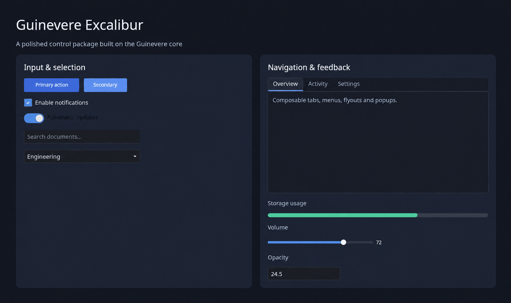

# Guinevere.Excalibur

A ready-to-use set of default controls for the [Guinevere](https://github.com/MASS4ORG/Guinevere)
immediate-mode GUI library. Everything here is an extension method on `Gui` living in the `Guinevere`
namespace, so it drops into an existing Guinevere app with a single package reference and no setup.



## Install

```
dotnet add package MASS4.Guinevere.Excalibur
```

## Quick Start

```csharp
using Guinevere;

public partial class App
{
    private bool _isEnabled = true;
    private string _name = "";
    private float _volume = 0.5f;
    private int _activeTab;

    public void Draw(Gui gui)
    {
        if (gui.Button("Run")) { /* clicked */ }
        gui.Checkbox(ref _isEnabled, "Enable feature");
        gui.TextInput(ref _name, "Your name");
        gui.Slider(ref _volume, 0f, 1f);

        gui.Tabs(ref _activeTab, tabs =>
        {
            tabs.Tab("Home", () => gui.DrawText("Home content", 12, Color.Gray));
            tabs.Tab("Settings", () => gui.DrawText("Settings content", 12, Color.Gray));
        });
    }
}
```

## Controls

| Group | APIs | Purpose |
|-------|------|---------|
| Actions | `Button`, `IconButton`, `ImageButton` | Pointer and keyboard-activated buttons with focus feedback. |
| Selection | `Checkbox`, `Toggle`, `RadioButton`, `RadioGroup`, `Dropdown` | Boolean, exclusive, and list selection. |
| Text and values | `TextInput`, `PasswordInput`, `TextArea`, `NumberField`, `Slider`, `ObjectField` | Text editing, scrub editing, numeric ranges, and compact object fields. |
| Display | `Image`, `ProgressBar`, `WrappedText`, `Toast`, `Toasts`, `ClearToasts` | Images, progress, wrapping, and transient notifications. |
| Navigation | `Tabs`, `TabBar`, `TabStrip`, `PillTabs`, `VerticalTabs`, `Breadcrumb`, `TreeView`, `FileBrowser` | Tabs, trails, virtualised trees, and an embeddable filesystem picker. Tabs are closable only with `closable: true`. |
| Menus and overlays | `AppBar`, `MenuBar`, `Flyout`, `CascadeMenu`, `ContextMenu`, `Popup`, `ModalPopup`, `Dialog`, `Tooltip` | Application chrome, command menus, popovers, modal windows, and delayed help. |
| Layout tools | `Splitter`, `DockSpace`, `DockLayout` | Resizable panes and persistent split/tab/float docking. |

## Buttons and selection

```csharp
if (gui.Button("Build")) Build();
gui.Checkbox(ref _enabled, "Enable feature");
gui.Toggle(ref _darkMode, "Dark mode");
gui.RadioGroup(ref _quality, [(0, "Low"), (1, "Medium"), (2, "High")]);
gui.Dropdown(["Draft", "Review", "Published"], ref _status);
```

Buttons and dropdowns receive mouse focus; use Tab to move through controls and Enter or Space to
activate buttons. Open popovers and dialogs constrain Tab to their visible controls.

## Text and numeric input

```csharp
_name = gui.TextInput(_name, placeholder: "Project name");
_notes = gui.TextArea(_notes, width: 420, height: 120);
gui.NumberField(ref _opacity, min: 0, max: 1, step: 0.05f);
gui.Slider(ref _opacity, min: 0, max: 1, step: 0.05f, showValue: true);
```

`NumberField` supports click-to-edit and drag scrubbing. `Slider` supports clicking, dragging beyond
its track, and arrow-key adjustments while focused.

## Overlays and dialogs

```csharp
gui.Popup(ref _showInspector, () => DrawInspector(gui), title: "Inspector");
gui.Dialog(ref _showDelete, "Delete project", () => gui.DrawText("This cannot be undone."),
    footer: () => { if (gui.Button("Delete")) DeleteProject(); });
gui.Tooltip(gui.CurrentNode, "More information");
```

`Popup` and `Dialog` preserve focus context while open and restore the opener after they close.
`Dialog` blocks the content behind it; `Popup` can opt into modal behavior through `ModalPopup`.

## File dialog

Keep a `FileDialogState`, open it with a request, and draw it every frame. Enumeration runs
asynchronously and listing rows are virtualised, so large or remote directories do not stall the
frame loop.

```csharp
var files = new FileDialogState();

files.Open(new FileDialogRequest
{
    Mode = FileDialogMode.OpenFile,
    Title = "Open scene",
    Filters = [FileDialogFilter.Of("Scenes", ".scene")],
    OnComplete = path => SelectedScene = path,
});

gui.FileDialog(files);
```

Use `gui.FileBrowser(files)` for the same picker embedded in a panel. Pass an
`IFileDialogFileSystem` to `FileDialogState` to browse engine assets, archives, remote storage, or a
test fixture. The built-in `PhysicalFileDialogFileSystem` supplies local quick-access folders and
drives.

## Menu Bar

Call `menus.Collapsible()` in the builder to show a compact menu toggle. Opening it reveals the titles;
choosing an action, clicking outside, or pressing Escape collapses it again. Menu bars, flyouts, cascade menus,
and context menus share a 300 ms submenu grace period and support nested arrow-key navigation.

```csharp
gui.MenuBar(menus =>
{
    menus.Menu("File", file =>
    {
        file.Item("New", () => NewFile(), "Ctrl+N");
        file.Separator();
        file.CheckItem("Autosave", () => _autosave, v => _autosave = v);
        file.Submenu("Export", export =>
        {
            export.Item("PNG", () => Export("png"));
            export.Item("SVG", () => Export("svg"));
        });
    });
    menus.Menu("Help", help => help.Item("About", () => ShowAbout()));
});
```

## Application Bar

```csharp
using (gui.AppBar(nativeTitlebar: useNativeTitlebar, resizable: true,
    minimumWindowSize: new System.Numerics.Vector2(480, 320)))
{
    gui.MenuBar(menus => menus.Collapsible()
        .Menu("File", file => file.Item("Open", OpenProject)));
    gui.Image(badge, width: 15, height: 15);
    gui.DrawText("Studio");
    gui.Node().ExpandWidth();
    if (gui.Button("◐", 36, 36)) ToggleTheme();
}
```

The scope lays out arbitrary widgets in a horizontal row, with normal gaps, padding and flexible nodes.
Repeated calls append content in order. It creates no content delegates, action lists or application title
model. The operating system's title is supplied separately when creating `GuiWindow`.

Desktop integrations register `IWindowChromeCapability` automatically. Where movement is supported, the bar
replaces native decorations. With `windowControls: true`, it appends minimize, maximize/restore and close
buttons after the content, independently of native decorations or movement support.
Close requests go through `GuiWindow.CloseRequested`, preserving the application's unsaved-work guard.
Passive content such as images and labels, and empty space, drag the window and double-click to maximize.
Buttons, editors, custom interactions and event handlers retain their own gestures.

Set `resizable: true` to enable four border and four corner handles while native decorations are hidden.
The desktop integrations register `IWindowResizeCapability` automatically. Handles show resize cursors,
retain pointer capture outside the window and keep the opposite edges fixed. `minimumWindowSize` defaults
to 160 by 100 logical desktop units; custom handles are disabled with native decorations or maximization.
Native sizing requests made during a GUI frame are applied after rendering finishes using the canvas.

Set `nativeTitlebar: true` to show the operating system's decorations at runtime; set it back to `false`
to use application chrome. The application buttons remain available while native decorations are showing. Keep the
scope at the same call site in both passes, and apply mode changes on the next frame. `windowControls: false`
embeds the bar and releases any decoration management it previously owned.

The current GLFW integrations cannot move native Wayland windows. The bar keeps native decorations when
`CanMove` is false so the window stays movable. Native Wayland custom-titlebar dragging requires a backend
with compositor move requests. Native snap gestures require support from the window integration.
Call `DrawWindowTitlebar(true)` when completely unmounting an application bar that replaced native chrome.

Let `AppBar` manage decorations while it is mounted; calling `DrawWindowTitlebar` independently every frame
competes with its remembered mode. Switching OpenGL/Vulkan wrappers does not add native Wayland dragging:
the GLFW integrations need compositor move support or an X11/XWayland startup choice.

### Extending a host application

Hosts can draw their own shell and registered plugin widgets inside the scope. `AppBarScope` is a value type;
extend the composed content through host methods or extension methods. Keep plugin factories and contribution
registries in the host, cache widget instances, and call their render methods in both GUI passes.

Main-menu actions can continue to use a command registry feeding `MenuBar`; arbitrary widgets such as play
controls or recent projects belong in the AppBar row. Apply contribution additions/removals between frames
so the same widgets appear in both passes, and remove cached instances when their plugin unloads.

### Migrating builder callers

Replace `gui.AppBar(bar => ...)` with a `using (gui.AppBar())` scope. Move `Leading` and `Content` widgets
directly into its body, render visible titles with `gui.DrawText`, and replace `Action` entries with ordinary
buttons. Use normal layout nodes and menus to arrange content and handle overflow.

## Tree View

```csharp
var state = new TreeViewState();
var items = new List<TreeItem>
{
    new("src", "src", 0, HasChildren: true),
    new("src/main", "main.cs", 1),
    new("assets", "assets", 0, HasChildren: true),
};

gui.TreeView(state, items, onClick: e => SelectedPath = e.Item.Label);
```

## Docking

```csharp
var layout = new DockLayout
{
    Root = new DockSplit(Axis.Horizontal, new DockLeaf("files"), new DockLeaf("editor"), 0.4f)
};

gui.DockSpace(layout,
    panelInfo: id => new DockPanelInfo("Files"),
    renderPanel: (id, g) => g.DrawText(id));
```

## License

This project is licensed under the MIT License. See the [LICENSE](LICENSE) file for details.
