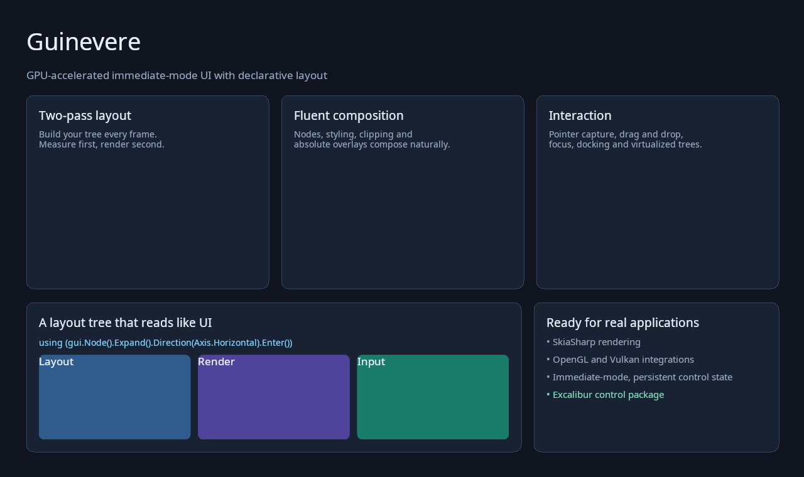

# Guinevere


[](https://github.com/mass4org/guinevere/actions/workflows/ci.yml)
[](https://github.com/mass4org/guinevere/actions/workflows/release.yml)
[](https://www.nuget.org/packages/MASS4.Guinevere/)
[](https://opensource.org/licenses/MIT)

A **GPU accelerated immediate mode GUI system** built on SkiaSharp, designed for high-performance applications with modern graphics APIs support. You can use it to create rich and beautiful apps.



> **Important**
>
> Guinevere is a very new library. While an earlier iteration is actively used within the Turian Game Engine, this specific library hasn't yet established a track record of reliability in production environments.

## Highlights

- **Cross-Platform: Windows, Linux & Mac**
- **Immediate Mode**
- **100% C# with Latest .NET**
- **GPU Accelerated Rendering**
- **Fluent API**
- **Multiple Graphics API Support**
- **Multiple Framework Integrations**

| Integration        | Graphics API | C# Framework | Use Case                                    |
|--------------------|--------------|--------------|---------------------------------------------|
| **Vulkan.SilkNET** | Vulkan       | Silk.NET     | Maximum performance, modern graphics        |
| **OpenGl.SilkNET** | OpenGL       | Silk.NET     | High-performance applications (Recommended) |
| **OpenGl.OpenTK**  | OpenGL       | OpenTK       | Game development, tools                     |
| **OpenGl.Raylib**  | OpenGL       | Raylib-cs    | Simple games, prototypes                    |

## Table of Contents

- [Highlights](#highlights)
- [Quick Start](#quick-start)
- [Features](#features)
  - [Layout](#layout)
  - [Interaction & Focus](#interaction--focus)
  - [Text & Styling](#text--styling)
  - [Animation](#animation)
  - [Shapes & Effects](#shapes--effects)
  - [Scrolling & Clipping](#scrolling--clipping)
  - [Headless Controls](#headless-controls)
  - [Excalibur Controls](#excalibur-controls)
  - [Layering & Transforms](#layering--transforms)
  - [Performance](#performance)
- [Examples](#examples)
- [License](#license)
- [Acknowledgments](#acknowledgments)

## Quick Start

### Starting a New App

1. **Create a new .NET project:**

   ```powershell
   dotnet new console -n MyGuinevereApp
   cd MyGuinevereApp
   ```

2. **Install Guinevere and an integration package:**

   ```powershell
   dotnet add package MASS4.Guinevere
   dotnet add package MASS4.Guinevere.OpenGL.SilkNET
   ```

3. **Basic Usage:**

   ```csharp
   using Guinevere;
   using Guinevere.OpenGL.SilkNET;

   public abstract class Program
   {
       public static void Main()
       {
           var gui = new Gui();
           using var win = new GuiWindow(gui);

           win.RunGui(() =>
           {
               gui.DrawRect(gui.ScreenRect, Color.Blue);
               gui.DrawText("Hello, world!");
           });
       }
   }
   ```

---

## Features

### Layout

- Flexible box model: margins, padding, gaps, alignment
- Horizontal/vertical flow with `Direction(Axis.Horizontal|Vertical)`
- Responsive sizing: `Expand()`, `ExpandWidth()`, `ExpandHeight()`
- Composable sizing: blend pixels, percentages, aspect ratios, remaining space, content size, and largest-child size
- Content alignment with `AlignContent(x, y)`

  ```csharp
  // Flexible layout with alignment and spacing
  using (gui.Node().Expand()
      .Direction(Axis.Horizontal)
      .Gap(20)
      .Margin(30)
      .Padding(15)
      .AlignContent(0.5f, 0.2f)
      .Enter())
  {
      // Children laid out horizontally with gaps
  }

  // Responsive sizing
  gui.Node().ExpandWidth().Height(100).Margin(10, 20).Padding(5, 10, 15, 20);

  // A continuous animation from 120 pixels to half the parent width.
  var width = UnitValue.Lerp(UnitValue.Pixels(120), UnitValue.Percentage(0.5f), progress);
  gui.Node().Width(width).Height(80);

  // Contributions can also be composed directly.
  gui.Node().Width(UnitValue.FitContent() + UnitValue.Pixels(24));
  ```

### Interaction & Focus

- Custom interactables for arbitrary shapes and regions
- Pointer capture, drag-and-drop, and input blocking
- Focus registration, nested navigation scopes, Tab cycling, and directional navigation

  ```csharp
  // Custom interactive area with shape
  var interactable = gui.GetInteractable();
  if (interactable.OnHover()) gui.DrawBackgroundRect(Color.LightBlue);
  if (interactable.OnClick()) Console.WriteLine("Clicked!");

  var shape = Shape.Circle(50);
  var shaped = gui.GetInteractable(position, shape);
  ```

### Text & Styling

- Rich text rendering with Unicode and emoji
- Wrapping, sizes, and color control
- Theming via transient color changes
- Runtime stylesheets with nested selectors, `>` child selectors, custom modifiers, variables,
  `@const`, `#inherit(...)`, and non-destructive provider/file reloads

  ```csharp
  gui.DrawText("Title", 24, Color.White);
  gui.DrawText("Wrapped text", 12, Color.Gray, wrapWidth: 300);
  gui.SetTextColor(Color.Red); // all text from now on will be red by default
  gui.DrawText("Red text");
  gui.SetTextColor(Color.White);
  ```

  Styles accept both the existing CSS-like form and PanGui's scalar syntax:

  ```csharp
  var styles = StyleSheetSource.FromFile("theme.pss");
  gui.AddStyleSheet(styles);

  using (gui.StyledNode("checkbox", isChecked ? ["checked"] : []).Enter()) { }
  ```

  ```css
  @const spacing = 12;
  checkbox {
      padding = @spacing;
      :checked(0.2 ease-out) { background-color = #4a90e2; }
  }
  ```

  Transition annotations are parsed for source compatibility; animated interpolation, expressions,
  shape/effect declarations, advanced macro families, and `#inherit-properties`/`#inherit-selector`
  remain planned styling features.

### Animation

- Smooth value/state transitions
- `AnimationFloat` and `AnimateBool01()` helpers
- Layout sizes can interpolate between arbitrary `UnitValue` modes without switching modes mid-animation
- Easing functions: `Linear`, `EaseIn/Out`, `SmoothStep`, `BackOut`, `ElasticOut`, `BounceOut`
- Live metrics: `ActiveAnimationCount`

  ```csharp
  var fade = gui.AnimateBool01(isVisible, 0.5f, Easing.SmoothStep);
  var animFloat = gui.GetAnimationFloat(value);
  animFloat.AnimateTo(target, 0.3f, Easing.ElasticOut);
  var v = animFloat.GetValue();

  var animatedWidth = UnitValue.Lerp(
      UnitValue.Pixels(100),
      UnitValue.Percentage(0.6f) + UnitValue.FitContent(0.15f),
      fade);
  gui.Node().Width(animatedWidth);

  // Status
  gui.DrawText($"Active animations: {gui.ActiveAnimationCount}", 12, Color.White);
  ```

### Shapes & Effects

- Basic shapes: circle, rectangle, arc
- Fills: solid, linear/radial gradients
- Borders and rounded corners
- Shadows: inner/outer with blur and spread
- Shape operations: union, subtract, intersect, transform

  ```csharp
  // Basic shape & gradient
  gui.DrawShape(center, Shape.Circle(100))
      .LinearGradientColor(Color.Red, Color.Blue, Angle.Degrees(45))
      .InnerShadow(Color.Black, new Vector2(0, 2), blur: 5, spread: -2)
      .OuterShadow(Color.Gray, new Vector2(2, 2), blur: 8, spread: 0);

  // Composition
  var combined = Shape.Circle(60) + Shape.Rectangle(80, 40);
  gui.DrawShape(center, combined);

  // Simple rect helpers
  gui.DrawBackgroundRect(Color.Blue, radius: 10);
  // gui.DrawRectBorder(rect, Color.Red, thickness: 2);
  ```

### Scrolling & Clipping

- Scrollbars: `ScrollY()` / `ScrollX()`
- Clip content to node bounds: `ClipContent()`
- Programmatic control: `ScrollToTop()`, `SetScrollPercentage()`
- Custom clip shapes with `SetClipArea()`

  ```csharp
  using (gui.Node(400, 300).Enter())
  {
      gui.ScrollY(Color.Black, Color.Gray);
      gui.ClipContent();

      for (int i = 0; i < 50; i++)
          gui.DrawText($"Line {i + 1}", 14, Color.White);
  }

  // Programmatic control
  gui.ScrollToTop("scrollNodeId");
  gui.SetScrollPercentage("scrollNodeId", Axis.Vertical, 0.5f);

  // Custom clip area
  gui.SetClipArea(gui.CurrentNode, Shape.Circle(100));
  ```

### Headless Controls

Core provides visual-free `Pressable`, `Toggleable`, `Selectable`, `Draggable`, and `Repeatable`
behaviors. Apply one inside any layout node and render from its stable `ControlVisualState`; activation
is delivered in the next layout pass so application state cannot produce different trees in a frame's
layout and render passes. See [Example 08](Examples/Example-08-HeadlessControls/Program.cs) for custom
button and switch skins with no Excalibur reference. Platforms can optionally provide
`IControlActivationSource` for controller or command activation and `IControlSemanticsSink` for
accessibility metadata.

### Excalibur Controls

The ready-to-use control collection lives in the separate
[`MASS4.Guinevere.Excalibur`](Guinevere.Excalibur/README.md) package. It provides buttons, text and
numeric inputs, menus, popups, dialogs, trees, tabs, docking, notifications, and more.

```powershell
dotnet add package MASS4.Guinevere.Excalibur
```

### Layering & Transforms

- Z-index layering and transforms

  ```csharp
  gui.SetZIndex(10);
  // gui.SetTransform(Matrix3x2.CreateScale(1.2f, 1.2f, center));
  ```

### Performance

- GPU-accelerated rendering via SkiaSharp
- Immediate mode with minimal memory overhead
- Dirty-flag updates and multi-pass rendering
- Real-time metrics: FPS, frame count, delta time

  ```csharp
  // Pass-based work split
  if (gui.Pass == Pass.Pass1Layout)
  {
      // Layout calculations
  }
  else if (gui.Pass == Pass.Pass2Render)
  {
      // Rendering only
  }

  // Metrics
  gui.DrawText($"FPS: {gui.Time.SmoothFps:F1}", 12, Color.White);
  gui.DrawText($"Frame: {gui.Time.Frames}", 12, Color.White);
  gui.DrawText($"Delta: {gui.Time.DeltaTime * 1000:F1}ms", 12, Color.White);
  ```

## Examples

The repository includes comprehensive [Examples](/Examples) demonstrating various features.

## License

This project is licensed under the MIT License. See the [LICENSE](LICENSE) file for details.

## Acknowledgments

- [SkiaSharp](https://github.com/mono/SkiaSharp): The foundation of our rendering system
- [OpenTK](https://github.com/opentk/opentk): OpenGL bindings for .NET
- [Raylib-cs](https://github.com/ChrisDill/Raylib-cs): C# bindings
- [Silk.NET](https://github.com/dotnet/Silk.NET): Modern .NET bindings for graphics APIs
- [NUKE](https://nuke.build): Build automation system
- [PanGui](https://pangui.io/): Inspiration for the API
- [Prowl.Paper](https://github.com/ProwlEngine/Prowl.Paper): Inspiration for the API
