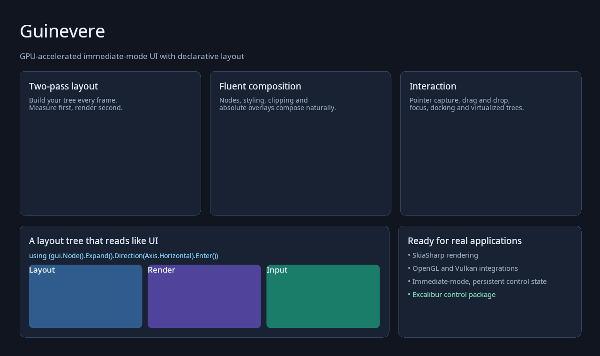

# Guinevere


[](https://github.com/mass4org/guinevere/actions/workflows/build-and-test.yml)
[](https://github.com/mass4org/guinevere/actions/workflows/check-new-release.yml)
[](https://www.nuget.org/packages/MASS4.Guinevere/)
[](https://opensource.org/licenses/MIT)

A **GPU accelerated immediate mode GUI system** built on SkiaSharp, designed for high-performance applications with modern graphics APIs support. You can use it to create rich and beautiful apps.



> **Important**
>
> Guinevere is a very new library. While an earlier iteration is actively used within the Turian Game Engine, this specific library hasn't yet established a track record of reliability in production environments.

## Highlights

- **Cross-Platform: Windows, Linux & Mac**
- **Immediate Mode**
- **100% C# with Latest .NET**
- **GPU Accelerated Rendering**
- **Fluent API**
- **Multiple Graphics API Support**
- **Multiple Framework Integrations**

| Integration        | Graphics API | C# Framework | Use Case                                    |
|--------------------|--------------|--------------|---------------------------------------------|
| **Vulkan.SilkNET** | Vulkan       | Silk.NET     | Maximum performance, modern graphics        |
| **OpenGl.SilkNET** | OpenGL       | Silk.NET     | High-performance applications (Recommended) |
| **OpenGl.OpenTK**  | OpenGL       | OpenTK       | Game development, tools                     |
| **OpenGl.Raylib**  | OpenGL       | Raylib-cs    | Simple games, prototypes                    |

## Table of Contents

- [Highlights](#highlights)
- [Quick Start](#quick-start)
- [Features](#features)
  - [Layout](#layout)
  - [Interaction & Focus](#interaction--focus)
  - [Text & Styling](#text--styling)
  - [Animation](#animation)
  - [Shapes & Effects](#shapes--effects)
  - [Scrolling & Clipping](#scrolling--clipping)
  - [Headless Controls](#headless-controls)
  - [Excalibur Controls](#excalibur-controls)
  - [Autoformers](#autoformers)
  - [Layering & Transforms](#layering--transforms)
  - [Performance](#performance)
- [Examples](#examples)
- [License](#license)
- [Acknowledgments](#acknowledgments)

## Quick Start

### Starting a New App

1. **Create a new .NET project:**

   ```powershell
   dotnet new console -n MyGuinevereApp
   cd MyGuinevereApp
   ```

2. **Install Guinevere and an integration package:**

   ```powershell
   dotnet add package MASS4.Guinevere
   dotnet add package MASS4.Guinevere.OpenGL.SilkNET
   ```

3. **Basic Usage:**

   ```csharp
   using Guinevere;
   using Guinevere.OpenGL.SilkNET;

   public abstract class Program
   {
       public static void Main()
       {
           var gui = new Gui();
           using var win = new GuiWindow(gui);

           win.RunGui(() =>
           {
               gui.DrawRect(gui.ScreenRect, Color.Blue);
               gui.DrawText("Hello, world!");
           });
       }
   }
   ```

---

## Features

### Layout

- Flexible box model: margins, padding, gaps, alignment
- Horizontal/vertical flow with `Direction(Axis.Horizontal|Vertical)`
- Responsive sizing: `Expand()`, `ExpandWidth()`, `ExpandHeight()`
- Composable sizing: blend pixels, percentages, aspect ratios, remaining space, content size, and largest-child size
- Composable constraints: `MinWidth(UnitValue.Pixels(20) + UnitValue.Expand(0.5f))` and matching
  min/max APIs on both axes. The pixel overloads and `LayoutStyle` float fields remain supported;
  expression constraints use separate nullable fields, so existing source remains valid. Recompile
  against this version because `LayoutStyle`'s binary layout has changed. Expression bounds below
  zero resolve to zero; when a minimum exceeds its maximum, the minimum wins.
- Content alignment with `AlignContent(x, y)`

  ```csharp
  // Flexible layout with alignment and spacing
  using (gui.Node().Expand()
      .Direction(Axis.Horizontal)
      .Gap(20)
      .Margin(30)
      .Padding(15)
      .AlignContent(0.5f, 0.2f)
      .Enter())
  {
      // Children laid out horizontally with gaps
  }

  // Responsive sizing
  gui.Node().ExpandWidth().Height(100).Margin(10, 20).Padding(5, 10, 15, 20);

  // A continuous animation from 120 pixels to half the parent width.
  var width = UnitValue.Lerp(UnitValue.Pixels(120), UnitValue.Percentage(0.5f), progress);
  gui.Node().Width(width).Height(80);

  // Contributions can also be composed directly.
  gui.Node().Width(UnitValue.FitContent() + UnitValue.Pixels(24));
  ```

### Interaction & Focus

- Custom interactables for arbitrary shapes and regions
- Pointer capture, drag-and-drop, and input blocking
- Focus registration, nested navigation scopes, Tab cycling, and directional navigation
- DOM-style events (click, drag, scroll, key, text, focus) with capture/target/bubble propagation,
  `StopPropagation` and `PreventDefault`
- Cursor shapes per node and pointer modes (hidden, relative, wrapped) across integrations

  ```csharp
  // Custom interactive area with shape
  var interactable = gui.GetInteractable();
  if (interactable.OnHover()) gui.DrawBackgroundRect(Color.LightBlue);
  if (interactable.OnClick()) Console.WriteLine("Clicked!");

  var shape = Shape.Circle(50);
  var shaped = gui.GetInteractable(position, shape);
  ```

  ```csharp
  // One listener on a list serves every row; the click bubbles up with the row as its target.
  using (gui.Node().Cursor(PointerCursor.Hand).Enter())
  {
      gui.On<ClickEvent>(e => Select(e.TargetId));
      foreach (var row in rows)
          using (gui.Node(-1, 32, $"row/{row}").Enter()) { /* ... */ }
  }
  ```

  Events for a frame's input run at the start of that frame, against the tree the previous frame laid out, so
  listeners change state before the new tree is built. `PreventDefault` hides the handled edge from
  `gui.Input`, so polling controls do not react a second time. See
  [Example 09](Examples/Example-09-EventsAndCursors/Program.cs).

### Text & Styling

- Rich text rendering with Unicode and emoji
- Wrapping, sizes, and color control
- `TextLayoutOptions` controls word, character, or mixed wrapping, line height, line limits,
  and a configurable ellipsis. `DrawText` and `WrappedTextLayout` share the line-breaking rules;
  `SetTextLayout` makes these settings inheritable within a node scope. Styled nodes accept
  `text-wrap`, `line-height`, `max-lines`, and `text-ellipsis` declarations.
- Theming via transient color changes
- Runtime `.pss` (PanGui Style Sheet) theme files with nested selectors, `>` child selectors, custom modifiers, `$tokens` layered across sheets and host overrides, host-readable `@const` metadata, `#inherit(...)` variants, `@font-face`/`url()` resolved against the sheet, `@import` through a host resolver, `file:line:col` errors, and non-destructive provider/file reloads

  ```csharp
  gui.DrawText("Title", 24, Color.White);
  gui.DrawText("Wrapped text", 12, Color.Gray, wrapWidth: 300);
  gui.DrawText("Select and copy this label", selectable: true);
  gui.DrawText("A long message", wrapWidth: 300,
      layout: new TextLayoutOptions { WrapMode = TextWrapMode.WordThenCharacter, MaxLines = 3 });
  gui.SetTextColor(Color.Red); // all text from now on will be red by default
  gui.DrawText("Red text");
  gui.SetTextColor(Color.White);
  ```

  Stylesheets use PanGui's `prop = value;` syntax:

  ```csharp
  var styles = StyleSheetSource.FromFile("theme.pss");
  gui.AddStyleSheet(styles);
  gui.StyleSheets.SetToken("accent", "#ff8800"); // host override above every sheet
  var themeName = styles.Current.Constants["theme-name"];

  using (gui.StyledNode("checkbox", isChecked ? ["checked"] : []).Enter()) { }
  ```

  ```css
  @const theme-name = "Night";
  @const spacing = 12;
  $accent = #4a90e2;
  @font-face { font-family = "Inter"; src = url("fonts/Inter.ttf"); }

  checkbox {
      padding = @spacing;
      :checked(0.2 ease-out) { background-color = $accent; }
  }
  ```

  Transition annotations, shapes, effects, mixins and macros parse for source compatibility and are kept in `StyleSheet.Deferred`; animated interpolation, expressions and applying those constructs remain planned styling features. The CSS-flavored `prop: value;`/`--x`/`var()` form is only accepted with `StyleSheetOptions.AllowCssSyntax` for migration tools.

  Color palettes are collections of independent, inheritable values. Override only the values a
  subtree needs:

  ```csharp
  using (gui.Node().Enter())
  {
      gui.CurrentNodeScope.Set(
      [
          ControlStyles.Value<ControlAccent, Color>(Color.Orange),
          ControlStyles.Value<ControlFieldHeight, float>(40f)
      ]);
      gui.Button("Locally styled");
  }
  ```

### Animation

- Smooth value/state transitions
- `AnimationFloat` and `AnimateBool01()` helpers
- Layout sizes can interpolate between arbitrary `UnitValue` modes without switching modes mid-animation
- Easing functions: `Linear`, `EaseIn/Out`, `SmoothStep`, `BackOut`, `ElasticOut`, `BounceOut`
- Live metrics: `ActiveAnimationCount`

  ```csharp
  var fade = gui.AnimateBool01(isVisible, 0.5f, Easing.SmoothStep);
  var animFloat = gui.GetAnimationFloat(value);
  animFloat.AnimateTo(target, 0.3f, Easing.ElasticOut);
  var v = animFloat.GetValue();

  var animatedWidth = UnitValue.Lerp(
      UnitValue.Pixels(100),
      UnitValue.Percentage(0.6f) + UnitValue.FitContent(0.15f),
      fade);
  gui.Node().Width(animatedWidth);

  // Status
  gui.DrawText($"Active animations: {gui.ActiveAnimationCount}", 12, Color.White);
  ```

### Shapes & Effects

- Basic shapes: circle, rectangle, arc
- Fills: solid, linear/radial gradients
- Borders and rounded corners
- Shadows: inner/outer with blur and spread
- Shape operations: union, subtract, intersect, transform

  ```csharp
  // Basic shape & gradient
  gui.DrawShape(center, Shape.Circle(100))
      .LinearGradientColor(Color.Red, Color.Blue, Angle.Degrees(45))
      .InnerShadow(Color.Black, new Vector2(0, 2), blur: 5, spread: -2)
      .OuterShadow(Color.Gray, new Vector2(2, 2), blur: 8, spread: 0);

  // Composition
  var combined = Shape.Circle(60) + Shape.Rectangle(80, 40);
  gui.DrawShape(center, combined);

  // Simple rect helpers
  gui.DrawBackgroundRect(Color.Blue, radius: 10);
  // gui.DrawRectBorder(rect, Color.Red, thickness: 2);
  ```

### Scrolling & Clipping

- Scrollbars: `ScrollY()` / `ScrollX()`
- Clip content to node bounds: `ClipContent()`
- Programmatic control: `ScrollToTop()`, `SetScrollPercentage()`
- Custom clip shapes with `SetClipArea()`

  ```csharp
  using (gui.Node(400, 300).Enter())
  {
      gui.ScrollY(Color.Black, Color.Gray);
      gui.ClipContent();

      for (int i = 0; i < 50; i++)
          gui.DrawText($"Line {i + 1}", 14, Color.White);
  }

  // Programmatic control
  gui.ScrollToTop("scrollNodeId");
  gui.SetScrollPercentage("scrollNodeId", Axis.Vertical, 0.5f);

  // Custom clip area
  gui.SetClipArea(gui.CurrentNode, Shape.Circle(100));
  ```

### Headless Controls

Core provides visual-free `Pressable`, `Toggleable`, `Selectable`, `Draggable`, and `Repeatable`
behaviors. Apply one inside any layout node and render from its stable `ControlVisualState`; activation
is delivered in the next layout pass so application state cannot produce different trees in a frame's
layout and render passes. See [Example 08](Examples/Example-08-HeadlessControls/Program.cs) for custom
button and switch skins with no Excalibur reference. Platforms can optionally provide
`IControlActivationSource` for controller or command activation and `IControlSemanticsSink` for
accessibility metadata.

### Excalibur Controls

The ready-to-use control collection lives in the separate
[`MASS4.Guinevere.Excalibur`](Guinevere.Excalibur/README.md) package. It provides buttons, text and
numeric inputs, menus, popups, dialogs, trees, tabs, docking, notifications, and more.

Selection controls include searchable `MultiDropdown` with removable chips and filtered bulk actions, plus `EnumDropdown` with automatic flag checkboxes, button groups and previous/next paging. See the [selection examples](Guinevere.Excalibur/README.md#searchable-selection) and [short Turian guide](docs/turian-selection-guide.md).

```powershell
dotnet add package MASS4.Guinevere.Excalibur
```

Platform integrations publish input, clipboard, window, timing, renderer and DPI services through
`gui.Platform`. Optional cursor, native-dialog, texture, GPU-effect and accessibility features use
typed discovery with explicit fallback behavior. See the
[platform integration guide](docs/platform-capabilities.md) for contracts and conformance checks.

### Autoformers

Attribute-driven forms ship as three packages. `MASS4.Attributes` holds the metadata
(`[Show]`, `[Range]`, `[Button]`, `[Title]`, …) with no GUI dependency.
[`Autoformers`](Autoformers/README.md) reflects a plain object into a GUI-free
`FormModel` of sections, fields and collections. `Autoformers.Excalibur` renders that model
with Excalibur controls through `gui.Form`.

Enum fields are searchable by default; `[Flags]` enables multiple selection. Use `[EnumButtons]` for a button group, `[EnumPaging]` for previous/next controls, and `[EnumLabel("Label")]` on enum members for display labels. Multi-object flag edits preserve each owner's unrelated bits. See the [attribute catalog](Attributes/README.md) and [enum form examples](Autoformers.Excalibur/README.md#enum-fields).

```powershell
dotnet add package MASS4.Attributes
dotnet add package MASS4.Autoformers
dotnet add package MASS4.Autoformers.Excalibur
```

See [Example 76](Examples/Example-76-Odin-Attributes/README.md) for a live tour.

### Layering & Transforms

- Z-index layering and transforms

  ```csharp
  gui.SetZIndex(10);
  // gui.SetTransform(Matrix3x2.CreateScale(1.2f, 1.2f, center));
  ```

### Performance

- GPU-accelerated rendering via SkiaSharp
- Immediate mode with minimal memory overhead
- Dirty-flag updates and multi-pass rendering
- Real-time metrics: FPS, frame count, delta time

  ```csharp
  // Pass-based work split
  if (gui.Pass == Pass.Pass1Layout)
  {
      // Layout calculations
  }
  else if (gui.Pass == Pass.Pass2Render)
  {
      // Rendering only
  }

  // Metrics
  gui.DrawText($"FPS: {gui.Time.SmoothFps:F1}", 12, Color.White);
  gui.DrawText($"Frame: {gui.Time.Frames}", 12, Color.White);
  gui.DrawText($"Delta: {gui.Time.DeltaTime * 1000:F1}ms", 12, Color.White);
  ```

## Examples

The repository includes comprehensive [Examples](/Examples) demonstrating various features.

## License

This project is licensed under the MIT License. See the [LICENSE](LICENSE) file for details.

## Acknowledgments

The integration packages embed three fonts. [Roboto](https://android.googlesource.com/platform/external/roboto-fonts/)
provides ordinary text; [Noto Emoji](https://github.com/googlefonts/noto-emoji) provides Unicode emoji
fallback; [Font Awesome 6 Free](https://fontawesome.com/license/free) provides widget icons. Roboto and
Noto Emoji use Apache 2.0 and the SIL Open Font License 1.1 respectively; the Font Awesome font also uses
the SIL Open Font License 1.1. Each integration package includes the license texts and font notices. The Font Awesome solid font
is embedded once per integration (about 388 KiB); Noto Emoji is about 2 MiB. Call `gui.DrawGlyph(codepoint)`
for a Font Awesome icon, `gui.DrawText(text)` for ordinary text and emoji, or set the fonts per scope with
`SetWidgetIconFont`, `SetTextFont`, and `SetEmojiFont`. The older `SetIconFont` still changes both icon
and fallback fonts. Font Awesome's glyphs use private
Unicode codepoints; use `WidgetIcons` for the built-in glyphs or Font Awesome's published mappings.

- [SkiaSharp](https://github.com/mono/SkiaSharp): The foundation of our rendering system
- [OpenTK](https://github.com/opentk/opentk): OpenGL bindings for .NET
- [Raylib-cs](https://github.com/ChrisDill/Raylib-cs): C# bindings
- [Silk.NET](https://github.com/dotnet/Silk.NET): Modern .NET bindings for graphics APIs
- [NUKE](https://nuke.build): Build automation system
- [PanGui](https://pangui.io/): Inspiration for the API
- [Prowl.Paper](https://github.com/ProwlEngine/Prowl.Paper): Inspiration for the API
